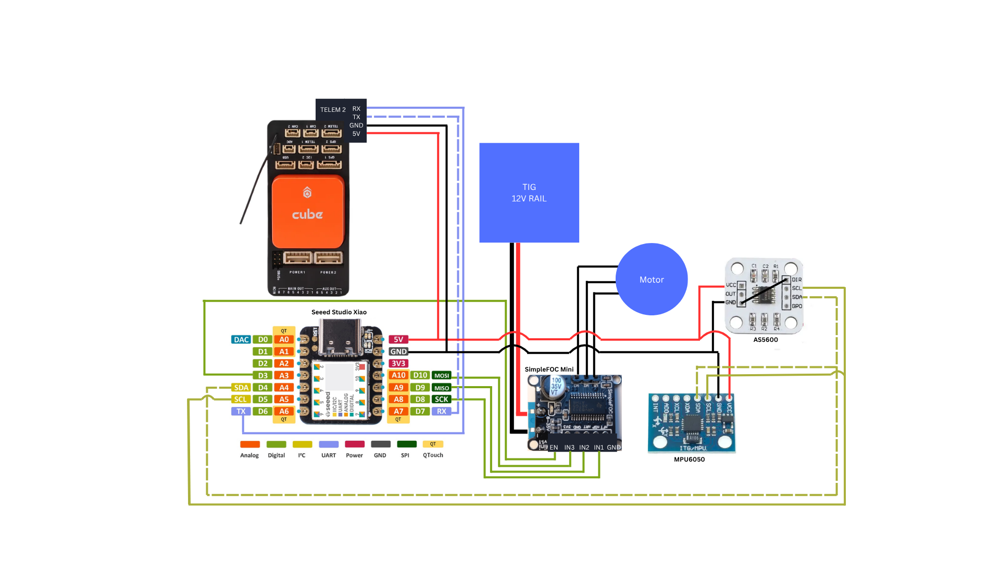
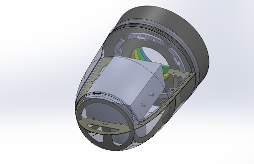

# UAV Camera Stabilization System
## Summary
This project involved the design and development of a single-axis UAV camera stabilization system for integration into a Class II unmanned aerial vehicle (UAV). The system combines embedded motor control, inertial sensing, encoder feedback, and flight controller communication to maintain camera orientation during flight.

The objective was to develop a compact electromechanical payload capable of real-time stabilization using field-oriented control (FOC) and closed-loop feedback.

---

### System Architecture

#### The stabilization system consists of:
- Pixhawk flight controller
- SAMD21 Seeeduino Microcontroller
- SimpleFOC Mini motor driver board
- AS5600 Magnetic Encoder
- GM3506 brushless gimbal Motor
- MPU6050 IMU-based orientation sensing

#### Data flow:    
Flight controller 
→ MAVLink telemetry
→ Embedded Controller
→ Stabilization Algorithm 
→ Motor Command 
→ Brushless Motor

---

# Mechanical Design

A custom electromechanical housing was designed to integrate the camera payload into a Class II UAV nose cone

#### Design considerations included:

- Payload packaging constraints
- Structural support during flight
- Weight reduction
- Component accessibility
- Manufacturability

The enclosure was modeled in SolidWorks and fabricated using rapid prototyping methods.

---

# Electronics and Embedded Control

## Hardware

- SAMD21 microcontroller
- Brushless gimbal motor
- Magnetic rotary encoder
- IMU sensor
- CAN communication interface

## Control System

The motor controller uses field-oriented control (FOC) to provide precise torque control and smooth stabilization.

The feedback loop consists of:

1. IMU measurement
2. Encoder position feedback
3. Error calculation
4. Control algorithm
5. Motor torque command

---

# Software

## Communication

The system communicates with the UAV flight controller using MAVLink.

Implemented features:

- Flight attitude telemetry reception
- Real-time stabilization commands
- CAN communication
- Embedded motor control

## Development Environment

- C/C++
- PlatformIO
- Arduino framework
- SimpleFOC library

---

# Testing and Validation

Testing focused on:

- Encoder feedback accuracy
- Motor response
- Closed-loop stabilization behavior
- Communication reliability

Validation included:

- Bench testing of stabilization response
- Controller tuning
- Integration testing with flight controller telemetry

---

# Results

The completed system demonstrated:

- Real-time camera stabilization
- Closed-loop position control
- UAV flight controller integration
- Custom mechanical integration into a UAV platform

---

# Future Improvements

Potential improvements include:

- Two-axis stabilization
- Reduced mechanical weight
- Custom PCB development
- Improved disturbance rejection
- Automated calibration routines

---

# Technologies Used

**Programming**
- C/C++
- Python

**Embedded**
- SAMD21
- Arduino
- PlatformIO
- MAVLink
- CAN Bus

**Hardware**
- Brushless motor control
- Magnetic encoder
- IMU sensors

**Mechanical**
- SolidWorks
- 3D Printing
- Rapid prototyping
